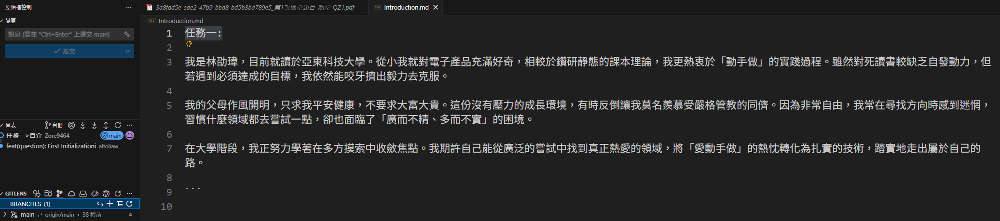
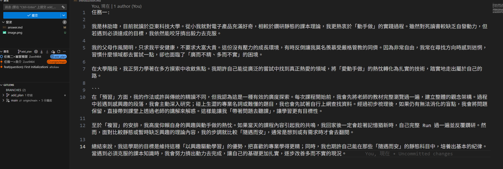
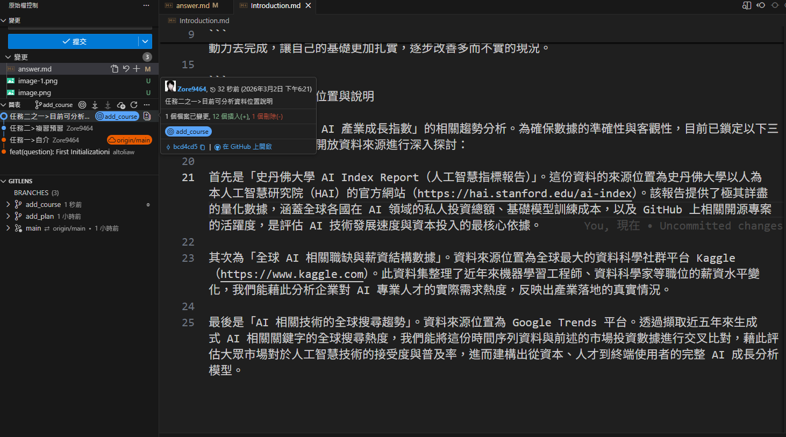
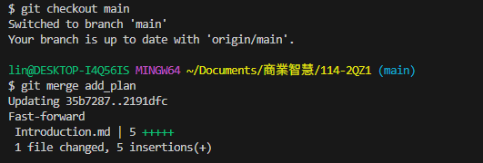
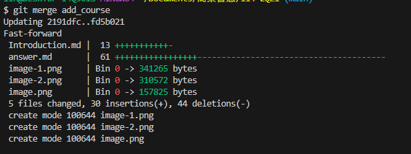

# 第1次隨堂題目-隨堂-QZ1

> 學號：112111125
> 姓名：林劭瑋

---

## 任務一：建立 Git 專案與自我介紹

（在此放置任務一的相關截圖：建立專案、新增 Introduction.md 並 Push 到遠端）

---

## 任務二：建立分支並修改內容

### 1. 分支 add_plan
（在此放置切換至 add_plan 分支並新增預習與複習計畫的截圖）

### 2. 分支 add_course
（在此放置切換至 add_course 分支並新增可分析資料說明的截圖）

---

## 任務三：合併分支與衝突觀察

### 觀察結果與心得

關於這次的分支合併操作，其實上學期修老師的課時就曾經「有幸」體驗過。當時大家在協作時，分支的狀況可謂是「群魔亂舞」，剛開始常常不知怎地就把原本寫好的程式碼給覆蓋掉，經歷了幾次慘痛教訓後，久而久之也逐漸掌握了 Git 的正確使用邏輯。

這次在依序將 `add_plan` 與 `add_course` 合併回 `main` 分支時，果不其然發生了預期中的合併衝突（Merge Conflict）。

**發生衝突的原因：**
當我們嘗試合併兩個以上的分支，且這些分支都剛好對「同一個檔案的同一個位置（行數）」進行了修改時，Git 的防呆機制就會啟動。因為 Git 系統無法自動判斷到底該保留哪一個分支的修改，所以它會暫停合併動作，將該檔案標記為「衝突狀態」。同時，Git 會在檔案內自動產生 `<<<<<<< HEAD`、`=======`、`>>>>>>>` 等標記符號，強制由使用者（開發者）手動介入，檢視並決定最終內容的去留，修改完成後才能再次提交並完成合併。

（在此放置終端機顯示 Conflict 以及程式碼中出現衝突標記的截圖）

